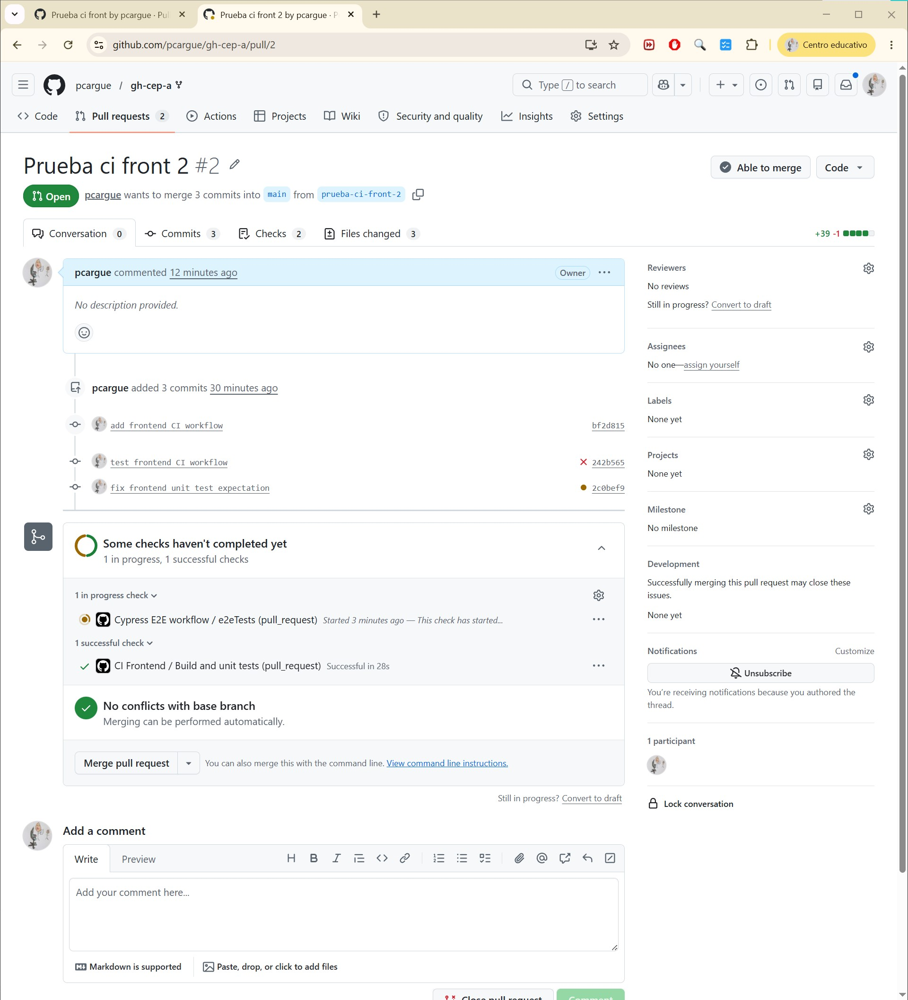

## Ejercicio 1: Workflow CI para el frontend

Para este ejercicio se ha creado el archivo:

```text
.github/workflows/ci-frontend.yml
```

El objetivo de este workflow es comprobar automáticamente que el proyecto `hangman-front` funciona correctamente cuando se realiza una Pull Request hacia la rama `main`.

El workflow se ejecuta únicamente cuando se cumplen dos condiciones: que exista una Pull Request hacia `main` y que los cambios realizados afecten a archivos situados dentro de la carpeta `hangman-front/`.

La configuración usada para disparar el workflow es la siguiente:

```yaml
on:
  pull_request:
    branches:
      - main
    paths:
      - 'hangman-front/**'
```

De esta forma, se evita que el workflow se ejecute cuando se modifican partes del repositorio que no pertenecen al frontend.

---


## Actions utilizadas

En este workflow se han utilizado las siguientes actions:

- `actions/checkout@v4`: permite descargar el contenido del repositorio dentro del entorno de ejecución de GitHub Actions.
- `actions/setup-node@v4`: permite instalar y configurar la versión de Node.js necesaria para ejecutar el proyecto.

---

## Prueba del workflow

Para probar el funcionamiento del workflow se creó una rama de prueba llamada `prueba-ci-front-2`. En esa rama se realizaron cambios dentro del directorio `hangman-front/` y posteriormente se creó una Pull Request hacia la rama `main`.

Al crear la Pull Request, GitHub Actions detectó el archivo `ci-frontend.yml` y lanzó automáticamente el workflow `CI Frontend`.

Durante el proceso aparecía también otro workflow relacionado con Cypress y pruebas end-to-end, pero ese workflow no corresponde al ejercicio obligatorio. Para este ejercicio se comprobó específicamente el resultado de:

```text
CI Frontend / Build and unit tests
```

---

## Fallos encontrados y corrección

En la primera ejecución del workflow, la build del frontend se completó correctamente, pero falló el paso de ejecución de los tests unitarios.

El error indicaba que uno de los tests esperaba encontrar un único elemento en una lista, pero realmente el componente estaba recibiendo dos elementos:

```text
Expected length: 1
Received length: 2
```

El fallo se encontraba en el archivo:

```text
hangman-front/src/components/start-game.spec.tsx
```

Para solucionarlo, se revisó el test y se modificó la expectativa para que coincidiera con el comportamiento real del componente. Después de hacer esta corrección, se volvió a probar el comando de test en local con:

```bash
npm run test
```

Una vez comprobado que los tests pasaban correctamente en local, se subió la corrección a la misma rama de la Pull Request. GitHub Actions volvió a ejecutar automáticamente el workflow y, en esta segunda ejecución, el job terminó correctamente.

---

## Resultado final

Tras corregir el test unitario, el workflow `CI Frontend` finalizó correctamente.

La comprobación aparece en verde en la Pull Request, concretamente en el job:

```text
CI Frontend / Build and unit tests
```

Esto confirma que el proyecto frontend instala sus dependencias, compila correctamente y supera los tests unitarios.

---

## Captura del ejercicio



---
