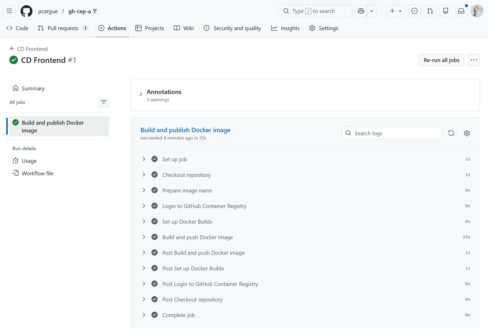

## Ejercicio 1: Workflow CI para el frontend

Para este ejercicio se ha creado el archivo:

```text
.github/workflows/ci-frontend.yml
```

El objetivo de este workflow es comprobar automáticamente que el proyecto `hangman-front` funciona correctamente cuando se realiza una Pull Request hacia la rama `main`.

El workflow se ejecuta únicamente cuando se cumplen dos condiciones: que exista una Pull Request hacia `main` y que los cambios realizados afecten a archivos situados dentro de la carpeta `hangman-front/`.

La configuración usada para disparar el workflow es la siguiente:

```yaml
on:
  pull_request:
    branches:
      - main
    paths:
      - 'hangman-front/**'
```

De esta forma, se evita que el workflow se ejecute cuando se modifican partes del repositorio que no pertenecen al frontend.

---


## Actions utilizadas

En este workflow se han utilizado las siguientes actions:

- `actions/checkout@v4`: permite descargar el contenido del repositorio dentro del entorno de ejecución de GitHub Actions.
- `actions/setup-node@v4`: permite instalar y configurar la versión de Node.js necesaria para ejecutar el proyecto.

---

## Prueba del workflow

Para probar el funcionamiento del workflow se creó una rama de prueba llamada `prueba-ci-front-2`. En esa rama se realizaron cambios dentro del directorio `hangman-front/` y posteriormente se creó una Pull Request hacia la rama `main`.

Al crear la Pull Request, GitHub Actions detectó el archivo `ci-frontend.yml` y lanzó automáticamente el workflow `CI Frontend`.

Durante el proceso aparecía también otro workflow relacionado con Cypress y pruebas end-to-end, pero ese workflow no corresponde al ejercicio obligatorio. Para este ejercicio se comprobó específicamente el resultado de:

```text
CI Frontend / Build and unit tests
```

---

## Fallos encontrados y corrección

En la primera ejecución del workflow, la build del frontend se completó correctamente, pero falló el paso de ejecución de los tests unitarios.

El error indicaba que uno de los tests esperaba encontrar un único elemento en una lista, pero realmente el componente estaba recibiendo dos elementos:

```text
Expected length: 1
Received length: 2
```

El fallo se encontraba en el archivo:

```text
hangman-front/src/components/start-game.spec.tsx
```

Para solucionarlo, se revisó el test y se modificó la expectativa para que coincidiera con el comportamiento real del componente. Después de hacer esta corrección, se volvió a probar el comando de test en local con:

```bash
npm run test
```

Una vez comprobado que los tests pasaban correctamente en local, se subió la corrección a la misma rama de la Pull Request. GitHub Actions volvió a ejecutar automáticamente el workflow y, en esta segunda ejecución, el job terminó correctamente.

---

## Resultado final

Tras corregir el test unitario, el workflow `CI Frontend` finalizó correctamente.

La comprobación aparece en verde en la Pull Request, concretamente en el job:

```text
CI Frontend / Build and unit tests
```

Esto confirma que el proyecto frontend instala sus dependencias, compila correctamente y supera los tests unitarios.

---

## Captura del ejercicio


## Ejercicio 2: Workflow CD para el frontend

En este ejercicio se ha creado un workflow de despliegue continuo para el proyecto `hangman-front`.

El objetivo del workflow es construir una imagen Docker del frontend y publicarla en el registro de contenedores de GitHub, es decir, en **GitHub Container Registry**.

Para ello se ha creado el archivo:

```text
.github/workflows/cd-frontend.yml
```

---

## Objetivo del workflow

El workflow realiza las siguientes tareas principales:

1. Descarga el código del repositorio.
2. Prepara el nombre de la imagen Docker.
3. Inicia sesión en GitHub Container Registry.
4. Configura Docker Buildx.
5. Construye la imagen Docker del frontend.
6. Publica la imagen en GitHub Container Registry.

La imagen se genera a partir del proyecto situado en:

```text
hangman-front/
```

---

## Evento que dispara el workflow

A diferencia del ejercicio 1, este workflow no se ejecuta automáticamente al hacer un push o una Pull Request.

Se ha configurado para ejecutarse manualmente desde la pestaña **Actions** de GitHub.

La configuración usada es:

```yaml
on:
  workflow_dispatch:
```

Esto permite lanzar el workflow solo cuando se quiera construir y publicar una nueva imagen Docker.

---

## Permisos del workflow

Para poder publicar la imagen en GitHub Container Registry, el workflow necesita permisos para leer el contenido del repositorio y escribir paquetes.

Por eso se ha añadido la siguiente configuración:

```yaml
permissions:
  contents: read
  packages: write
```

El permiso `contents: read` permite leer el código del repositorio.

El permiso `packages: write` permite publicar la imagen Docker en el registro de paquetes de GitHub.

---

## Funcionamiento del workflow

El workflow contiene un job llamado:

```text
build-and-push-image
```

Este job se ejecuta en una máquina virtual Ubuntu proporcionada por GitHub Actions:

```yaml
runs-on: ubuntu-latest
```

Dentro del job se realizan los pasos necesarios para construir y publicar la imagen Docker.

---

## Actions utilizadas

En este workflow se han utilizado las siguientes actions:

### `actions/checkout@v4`

Se utiliza para descargar el código del repositorio dentro de la máquina donde se ejecuta GitHub Actions.

### `docker/login-action@v4`

Se utiliza para iniciar sesión en GitHub Container Registry.

En este caso, se usa `GITHUB_TOKEN`, que permite autenticarse desde el propio workflow sin tener que crear un token manual.

### `docker/setup-buildx-action@v4`

Se utiliza para configurar Docker Buildx, que permite construir imágenes Docker de forma más avanzada dentro de GitHub Actions.

### `docker/build-push-action@v7`

Se utiliza para construir la imagen Docker y publicarla en el registro.

---

## Nombre de la imagen publicada

La imagen se publica en GitHub Container Registry con un nombre similar a:

```text
ghcr.io/pcargue/hangman-front:latest
```

Además, también se publica otra etiqueta usando el hash del commit:

```text
ghcr.io/pcargue/hangman-front:<hash-del-commit>
```

La etiqueta `latest` permite identificar fácilmente la última imagen publicada.

La etiqueta basada en el hash del commit permite saber exactamente desde qué versión del código se generó la imagen.

---

## Prueba del workflow

Para probar el workflow, primero se subió el archivo `cd-frontend.yml` a la rama `main`.

Después, desde GitHub, se accedió a la pestaña **Actions**, se seleccionó el workflow **CD Frontend** y se ejecutó manualmente con el botón **Run workflow**.

El workflow se ejecutó correctamente y completó todos sus pasos:

```text
Checkout repository
Prepare image name
Login to GitHub Container Registry
Set up Docker Buildx
Build and push Docker image
```

El paso más importante es:

```text
Build and push Docker image
```

ya que es el encargado de construir la imagen Docker del frontend y publicarla en GitHub Container Registry.

---

## Resultado final

El workflow finalizó correctamente.

En la ejecución de GitHub Actions se puede comprobar que el job:

```text
Build and publish Docker image
```

terminó con estado correcto.

Esto confirma que la imagen Docker del frontend se construyó y se publicó correctamente en el registro de contenedores de GitHub.

---

## Captura del ejercicio


